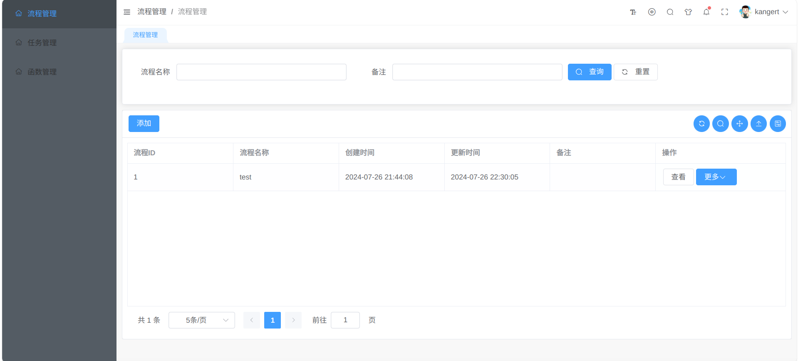
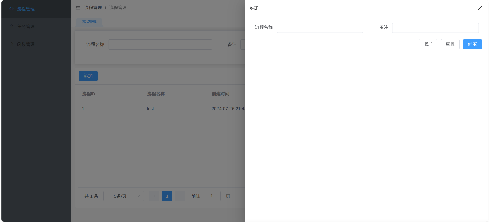
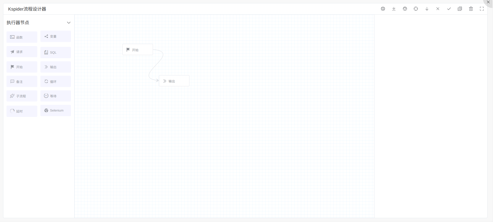

## 简介

Kspider 是一个爬虫\WEB 自动化开发平台，以图形化方式定义流程，无需代码即可实现一个流程。

## 流程创建

### 点击创建按钮

填入流程名称与描述后点击`确定`按钮

## 流程设计

通过可视化拖拽形式快速设计出流程

## 流程测试

可完整运行当前设计的流程，快速测试流程，与`流程调试`的区别在于`流程测试`会完整执行，直到错误出现或流程终止

## 流程调试

可完整运行当前设计的流程，快速测试流程，与`流程测试`的区别在于`流程调试`是属于单步调试，用户触发`下一步`才会执行

## 流程运行

流程的正式运行需要通过任务驱动形式，注入`metedata`以一次性或周期性运行方式，流程运行参考[任务管理](/TaskManage/intro.md)
